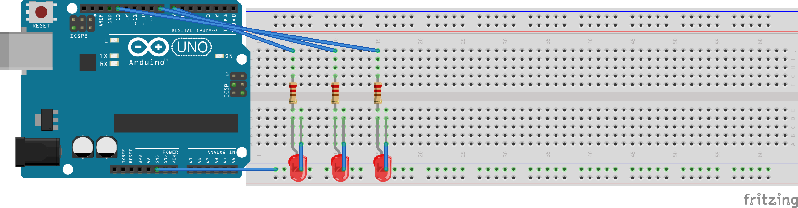

#led-traffic-light

Simulates a standard traffic light using an Arduino Uno and three LEDs. A basic but fundamental embedded systems project to practice GPIO control, timing logic, and circuit design.

---

##Components Used

- Arduino Uno
- Breadboard
- 3x LEDs (Red, Yellow, Green)
- 3x 220Ω Resistors
- Jumper Wires
- USB Cable

---

##Circuit Diagram

---

##How It Works

1. The green LED turns on for 5 seconds
2. Then the yellow LED turns on for 2 seconds
3. Finally, the red LED turns on for 5 seconds
4. The cycle repeats

---
